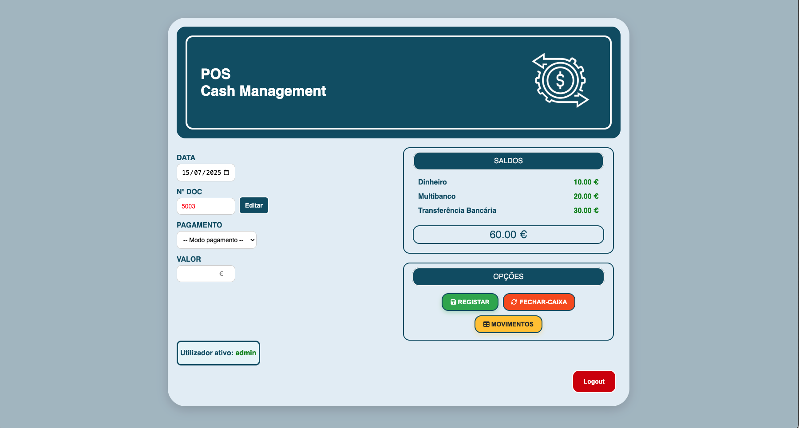
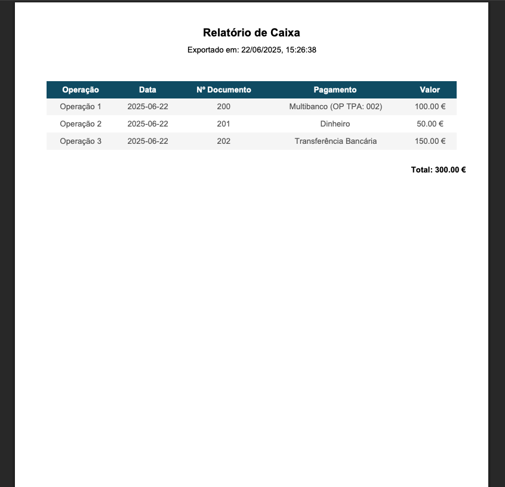
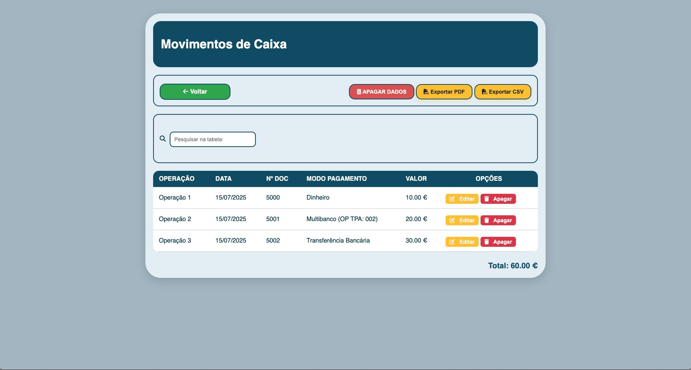

# 💼 POS Cash Management

POS Cash Management is a simple and intuitive web application to manage and track daily cash transactions. The interface allows easy entry of payments, calculation of balances, and export of data for reports or archiving.

---

## 🚀 Features

- 💸 Register income by operation
- 🧾 Multiple payment methods:
  - Cash
  - Multibanco (with OP TPA field)
  - Bank transfer
- 📅 Auto date insertion
- 📄 Document number auto-increment
- 🔎 Live filtering of records
- ✏️ Edit and delete registered rows
- 📤 Export to:
  - PDF
  - CSV
- 🔄 Full reset (clears table and database)

---

## 🖥️ Interface

### 🔹 Registration Panel



- Input operation, date, document number, payment method, and value.
- See total and per-method balances.
- Register, reset, or access full records.

---

### 🔹 PDF Export Example



- Exported with date and time
- Structured table
- Includes total at the bottom

---

### 🔹 Transactions Table



- List all records
- Edit or delete each entry
- Export or clear table

---

## 🧩 Technologies Used

- **Frontend:** HTML, CSS, JavaScript
- **PDF Export:** jsPDF + AutoTable
- **Backend:** Node.js + Express
- **Database:** PostgreSQL
- **Styling:** Font Awesome for icons

---

## 📦 How to Run

1. Clone this repository:
   ```bash
   git clone https://github.com/your-user/pos-cash-management.git
   ```

2. Install backend dependencies:
   ```bash
   cd pos-cash-management
   npm install
   ```

3. Start the server:
   ```bash
   node server.js
   ```

4. Access the app:
   ```
   http://localhost:3000
   ```

---

## 🛠️ Future Improvements

- Authentication system for restricted access
- Daily closing feature with history
- Mobile responsiveness
- Graphical dashboards

---

## 📷 Screenshots Location

All images are placed in the `/assets/` folder. Make sure to create that directory and move the provided images there:

```
assets/
├── front-app.png
├── pdf.png
└── table.png
```
