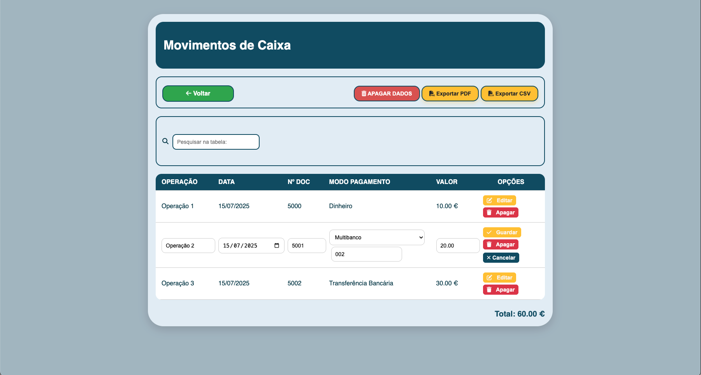
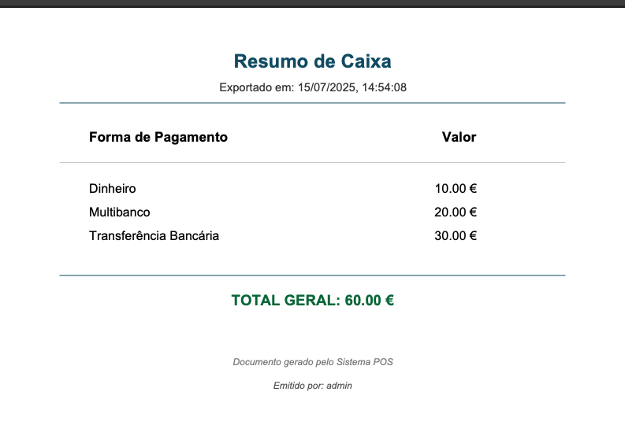

# 💼 POS Cash Management

POS Cash Management is a simple and intuitive web application to manage and track daily cash transactions. The interface allows easy entry of payments, calculation of balances, and export of data for reports or archiving.

---

## 🚀 Features

- User authentication (JWT protected)
- 💸 Register income by operation
- 🧾 Multiple payment methods:
  - Cash
  - Multibanco (with OP TPA field)
  - Bank transfer
- 📅 Auto date insertion
- 📄 Document number auto-increment
- 🔎 Live filtering of records
- ✏️ Edit and delete registered rows
- 📤 Export to:
  - PDF
  - CSV
- 🔄 Full reset (clears table and database)

---

## 🖥️ Interface

### 🔹 Registration Panel

-  Date, document number, payment method, and value.
- See total and per-method balances.
- Register, reset, or access full records.

---

### 🔹 PDF Export Example

- Exports include date, time, and user information
- Structured table
- Includes total at the bottom

---

### 🔹 Transactions Table and Daily closure

- List all records

- Edit or delete each entry

- Daily closure with reports

---

- Database - PostgresSQL 

## 🧩 Technologies Used

- **Frontend:** HTML, CSS, JavaScript
- **Authentication:** JWT (JSON Web Token)
- **PDF Export:** jsPDF + AutoTable
- **Backend:** Node.js + Express
- **Database:** PostgreSQL
- **Styling:** Font Awesome for icons

## 🛠️ Future Improvements

- Individual user histories (each user sees only their own records)
- Graphical dashboards

---

