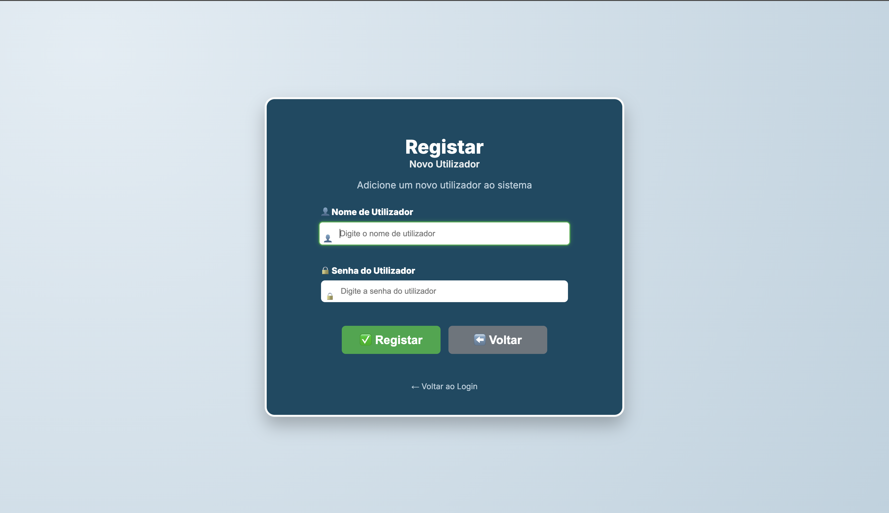
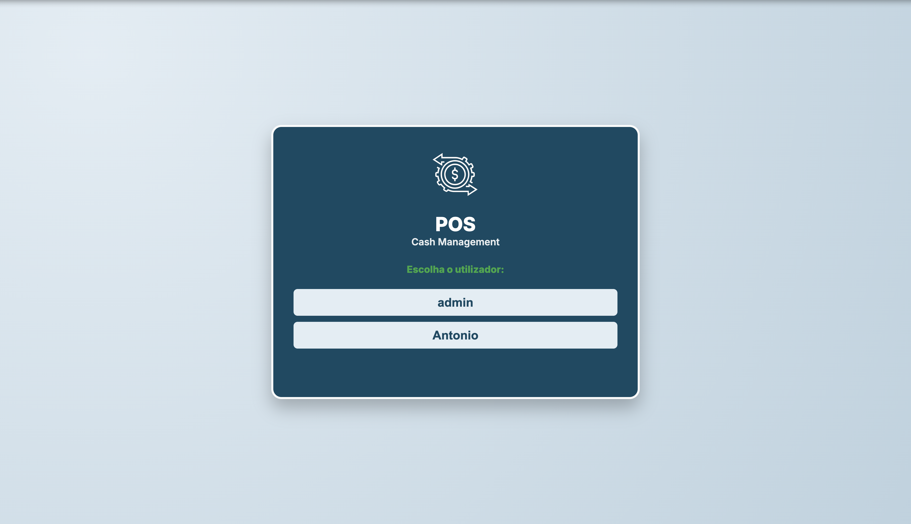
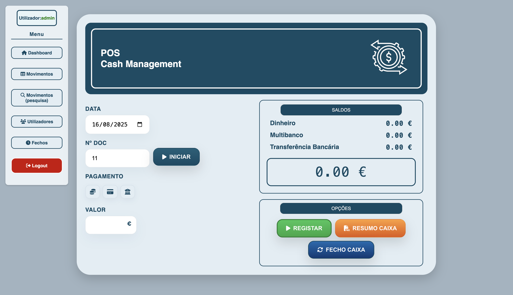
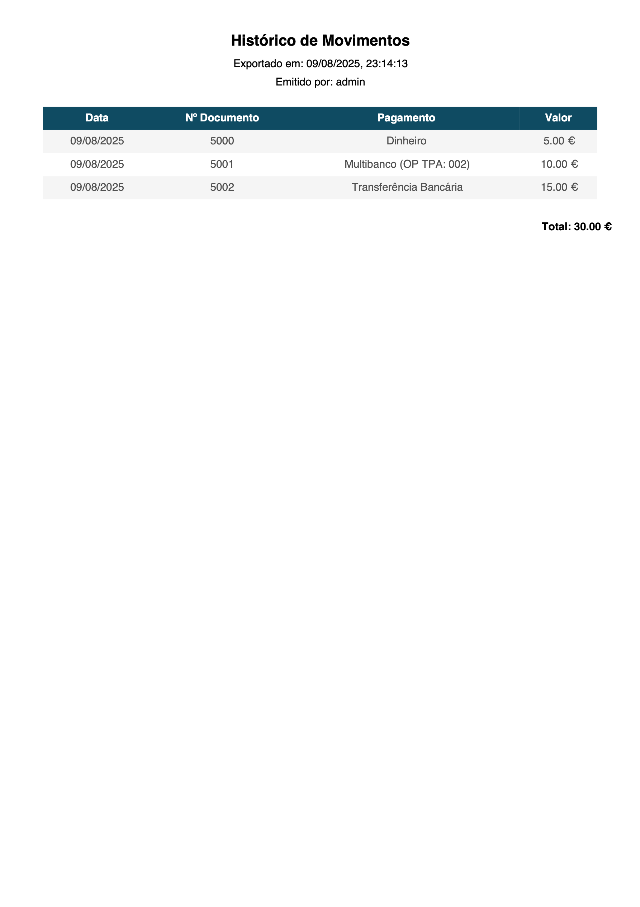
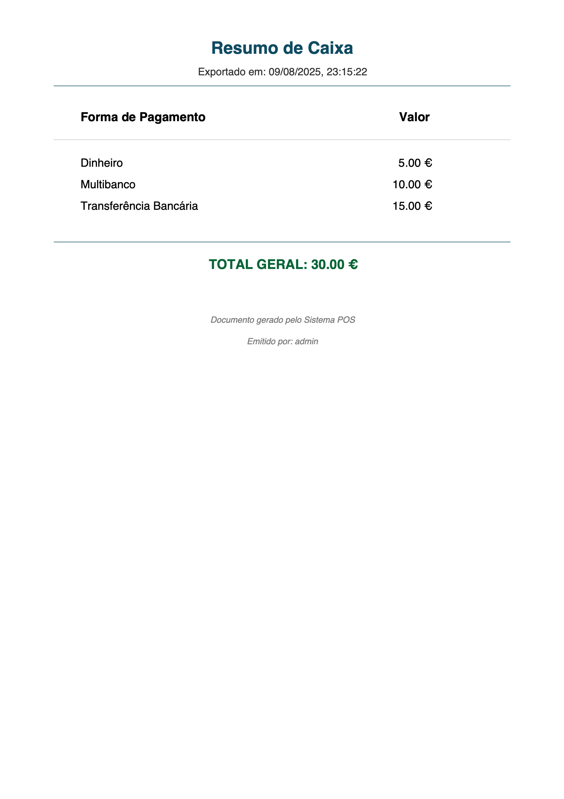
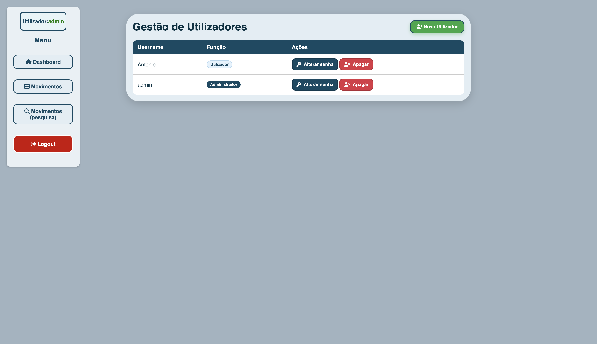
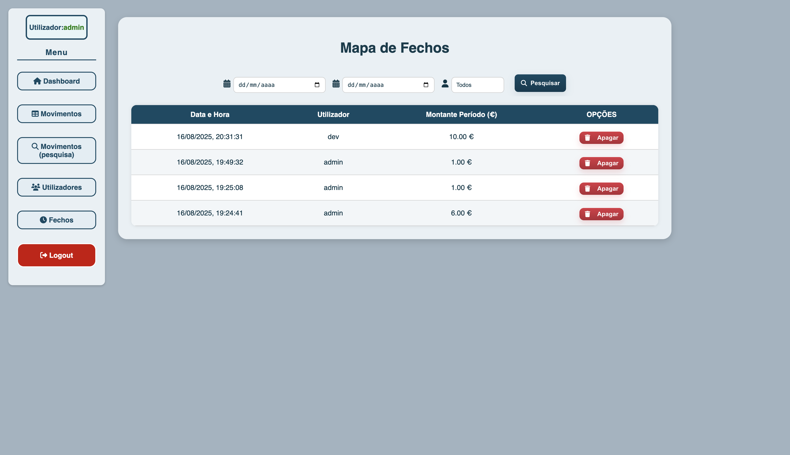

# 💰 Cash Management Web App

A full-featured **Cash Management Web Application** built with **HTML, CSS, JavaScript, Node.js, Express, and PostgreSQL**, designed to handle daily cash operations, track payments, and generate detailed reports.  
The system includes authentication with JWT, role-based user management, daily balance closure, and export options for CSV/PDF.

---

## 🚀 Features

### 🔐 Authentication & Security

- **JWT-based authentication** for secure access.
- Role-based access:
  - **Administrator** – Full access, user management, configuration.
  - **User** – Can register transactions and view data.
- Automatic **session expiration** and redirect to login.
- Secure API routes with token validation.

### 📊 Dashboard

- Real-time display of daily balances by payment method:
  - 💵 Cash
  - 💳 Multibanco (with optional TPA reference)
  - 🔄 Bank Transfer
- Automatic balance calculation after each operation.
- **Close Balance** button to reset daily totals (values remain in history).
- Persistent balance status after reload (shows last closure of the day).

### 🧾 Transactions (Tabela)

- Register new operations with:
  - Date
  - Document number
  - Payment method
  - Value
  - Optional **OP TPA** field for Multibanco payments
- Edit and delete records inline.
- Automatic **document sequence** management.
- Export table data to **CSV** or **PDF**.

### 📜 History

- Search operations by **date range**.
- Filtered results update:
  - Transaction table
  - Balance summary
- Export history to CSV/PDF.
- Maintains original formatting for OP TPA.

### 🧮 Closures (Fechos)

•	View all daily cash closures made by users.
•	Each entry includes:
• Date and time of closure
• User who performed it
• Total amount at the time of closure
• Amount of the period (difference from previous closure)
• Filter by date range and user
• Admin can delete closure entries if needed

### 👥 User Management (Admin only)

- List all registered users with role badges.
- Create new users.
- Change passwords.
- Delete users.
- Admin role highlighted visually.

### 📦 Data & Storage

- All data stored in **PostgreSQL**.
- Separate tables for:
  - Transactions (`registos`)
  - Daily balances (`saldos_diarios`)
  - Users (`utilizadores`)
- Backend built with **Express** and protected API routes.

---

## 📸 Screenshots

### ➕ Register New User



### 🔑 Login



### 📊 Dashboard



### 📋 Transactions Table


### 📜 History Page


#### 📄 PDF Example – History



#### 📄 PDF Example – Daily Summary



### 👥 User Management



### 🧮 Closures (Fechos)



---

## 🛠️ Tech Stack

### Frontend

- **HTML5**, **CSS3**, **JavaScript**
- Responsive design for desktop use
- Client-side validation

### Backend

- **Node.js** with **Express**
- **JWT Authentication**
- RESTful API architecture

### Database

- **PostgreSQL**
- Separate tables for transactions, daily balances, and users

---

## 📂 Project Structure

```
private/
├── index.html             # Dashboard
├── tabela.html            # Transactions table
├── historico.html         # History page
├── utilizadores.html      # User management
├── fechos.html            # Daily closures page (admin only)
├── script.js              # Main dashboard logic
├── script-tabela.js       # Table logic
├── script-historico.js    # History page logic
├── script-utilizadores.js # User management logic
├── script-fechos.js       # Closures page logic
public/
├── login.html             # Login page
server.js                  # Backend API
```

---

## 🛠 Installation

**1. Clone the repository**

```bash
git clone https://github.com/p0k4/Cash-Management-Web-App-main.git
cd cash-management-web-app
```

**2. Install dependencies**

```bash
npm install
```

**3. Configure environment variables**  
Create a `.env` file with:

```plaintext
PORT=3000
JWT_SECRET=your_jwt_secret
DB_HOST=localhost
DB_PORT=5432
DB_USER=postgres
DB_PASSWORD=your_password
DB_NAME=POS_BD
```

**4. Run migrations**

```bash
psql -U postgres -d POS_BD -f migrations.sql
```

**5. Start the server**

```bash
npm start
```

---

## 🚀 Features

- **User Authentication** with JWT
- **Role-based Access Control** (Admin / User)
- **Daily Balance Closure** with persistence in DB
- **Transaction Recording** with multiple payment methods
- **Export Data** to CSV and PDF
- **History Search** by date range
- **User Management** (add, edit password, delete)
- **Secure Backend API** with Express + PostgreSQL

---

## 📜 License

This project is licensed under the MIT License.
